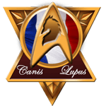

<p align="center">
  
</p>

<h1 align="center">La Meute 3.0 🐺 🇫🇷</h1>

<p align="center">
  <b>A gaming association's governance, moved on-chain — no board, no single point of failure.</b>
</p>

<p align="center">
  <kbd>Solidity 0.8.28</kbd> · <kbd>Hardhat 3</kbd> · <kbd>Vue 3</kbd> · <kbd>viem</kbd> · <kbd>Sepolia</kbd>
</p>

<p align="center">
  <a href="https://github.com/CyrilHskt/la-meute-3/actions/workflows/ci.yml"></a>
  
  
  
  
  <a href="LICENSE"></a>
</p>

<p align="center">
  Alyra certification project — RS6515, <i>Développer une application décentralisée avec les technologies blockchain</i>
</p>

---

## 🐺 The problem

La Meute 2.0 is a 25-year-old gaming association with about fifteen members. It's
falling asleep: voting turnout keeps dropping, and the president has to chase members
down one by one to reach quorum. An association whose members no longer vote is
paralyzed — no decision can be made anymore, not even the ones that would bring in
fresh blood.

Yet absence isn't refusal. In a quorum computed on registered members, a member's
silence weighs as much as their opposition, and blocks everyone else without meaning to.

The same fragility shows up in reverse: what becomes of the Meute if its president
disappears, or simply wants to step down? No one else can call a vote, the treasury is
a bank account in the treasurer's name, and handing it over means redoing the bylaws,
the prefecture paperwork, and the bank mandate. The two problems are really one:
**everything rests on a single person.**

## 🔗 The prototype

La Meute 3.0 moves the association's governance onto a public blockchain:

- **A membership card** — a non-transferable ERC-721 that carries its holder's rank
  and is itself the entire membership registry.
- **A two-tier membership cycle**, drawn from the association's real practices:
  applicant → Cub (probationary, three months) → Wolf (permanent), with confirmation
  decided by a three-outcome vote: confirm, postpone, or reject.
- **Dormancy** — a Wolf who hasn't voted in six months drops out of quorum without
  losing anything or being penalized, and a single vote wakes them back up. Quorum
  self-repairs: the pack only measures itself against those who are present.
- **No board.** Once deployed, the contract has no owner, no pause, no emergency
  function. The president holds no technical power at all.

The scope stops there: tournaments, sign-ups, and rankings stay off-chain. The
prototype handles governance, not activity.

This is a thought experiment — "what if we turned the Meute into a DAO?" — not a
production project. The loi 1901 legal shell remains; only the governance mechanics
are moved on-chain.

## ✅ What's in the box

| | |
|---|---|
| 🗳️ **Governance** | Admission, confirmation, exclusion, expense and donation proposals — all on-chain, all publicly auditable |
| 🃏 **Membership card** | Soulbound ERC-721, one per member, carries rank and activity |
| 💤 **Self-healing quorum** | Dormant members are excluded from quorum math, and can be pruned from the active set to keep it cheap to compute |
| 🌐 **Front-end** | Vue 3 dashboard — wallet connect, live governance feed, French/English toggle |
| 🔐 **Security-reviewed** | Reentrancy tested with a real attack contract, CI enforces the front's ABI never drifts from the compiled contract |

## 📚 Documentation

- [Cahier des charges](docs/cahier-des-charges.md) — context, scope, state machine,
  token rationale, security, accepted limitations.

## 🧱 Stack

Solidity 0.8.28 · Hardhat 3 · OpenZeppelin 5.6 · Vue 3 · TypeScript · viem
Deployed via Hardhat Ignition on a public testnet (Sepolia). No real ETH involved.

## ⚙️ Commands

### Tests

```shell
npx hardhat test            # all tests
npx hardhat test solidity   # Solidity unit tests
npx hardhat test mocha      # TypeScript integration tests
```

### Deployment

On a local simulated chain:

```shell
npx hardhat ignition deploy ignition/modules/<Module>.ts
```

On Sepolia, you need an account funded with test ETH. The private key is read from
the `SEPOLIA_PRIVATE_KEY` configuration variable, set via the `hardhat-keystore`
plugin (it's never written in plaintext to the repo):

```shell
npx hardhat keystore set SEPOLIA_PRIVATE_KEY
npx hardhat ignition deploy --network sepolia ignition/modules/<Module>.ts
```

## 📄 License

The code is [MIT licensed](LICENSE) — use it, fork it, ship it. "La Meute" the
name and its logo are not part of that grant and remain the association's
property; see [TRADEMARK.md](TRADEMARK.md).
